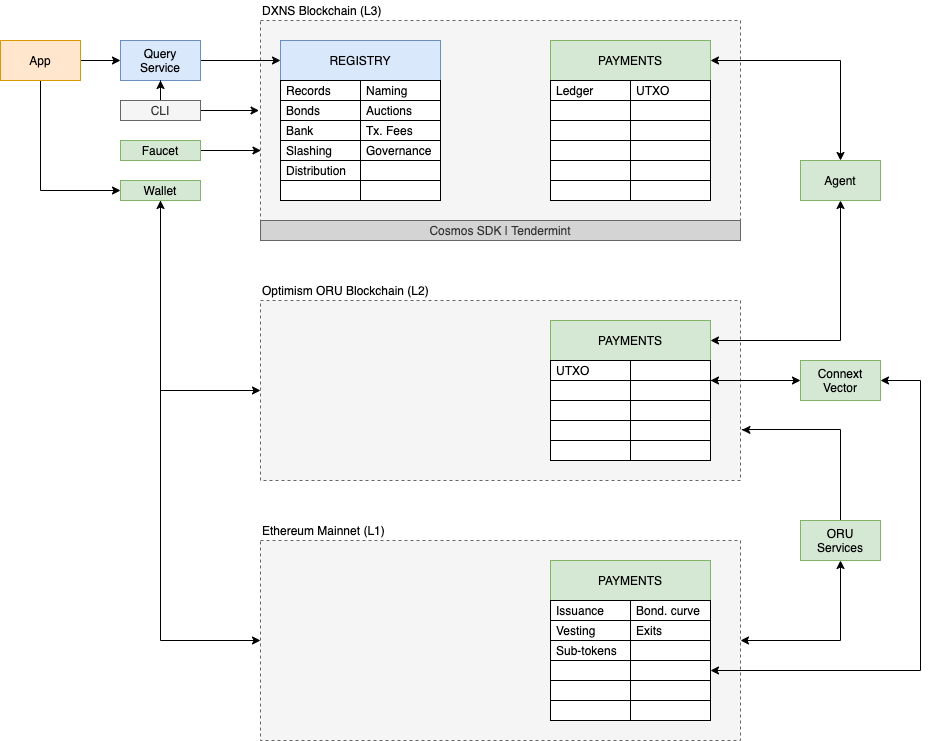

## Specification

### Registry

* Immutable records and links (IPLD compliant)
* Naming
  * Mutable names pointing to immutable records
  * Authorities (& sub-authorities) for namespace control
  * Auctions for authority names
* Bonds
  * Rent for records and authorities

### Payments

* Bidirectional value transfer
  * Ethereum user to DXNS validator set (deposit)
  * DXNS validator set to Ethereum user (withdrawal)
  * Redeem WUSD (as a user at DXNS side) for ETH (on Ethereum side)
  * Trigger generation of ERC20 subtoken on Ethereum from DXNS
* Fraud on DXNS (validator set) translates to slashing on Ethereum
* Genesis state for DXNS determined from Ethereum contract
  * Enables slashing
* Emergency exit from DXNS chain

## Design / Implementation

### Ethereum Mainnet (L1)

* Ethereum mainnet is the root of trust for the system
* Funds (tokens) originate on Ethereum and can be moved to/from DXNS
* The genesis state of DXNS is stored on Ethereum

### Optimism Optimistic Rollup (L2)

* Ethereum scaling solution (Layer 2 blockchain technology)
* Used to efficiently synchronize state of funds between DXNS and Ethereum mainnet (lower fees, higher throughput)
* Enables fraud proofs and slashing of DXNS validators on Ethereum mainnet if they sync invalid state to Ethereum
* DXNS validators also run ORU sequencers (validator and sequencers keys are cryptographically linked together)

Note: Currently ORU L2 uses a PoA consensus algorithm (Clique). Eventually, this might need to be changed to Tendermint consensus (users expect economic guarantees of validator honesty and Clique doesn't provide that).

#### ORU Enhancements

* Federated sequencers
* Instant exits to Ethereum mainnet
  * Sequencers assume potential fraud risk

### DXNS Chain (L3)

* Tendermint and cosmos-sdk based blockchain
* Custom cosmos-sdk modules for registry (records, naming), bonds and auctions

### Agent

* Synchronizes account balances on DXNS (L3) with UTXO set on ORU chain (L2) and vice versa

Note: In order to not fork core cosmos-sdk modules to use UTXO based transfers, the plan for the initial release is to use the agent to synchronize between account balances and UTXO sets. This means the funds on L3 are at risk if the DXNS validator set fails. This is also why we have a Layer 3.

### Query Service

* GQL based service to read state from DXNS
* GQL mutation support for sending transactions to DXNS
* Implemented in golang and integrated with DXNS but NOT a cosmos-sdk module

### Connext Vector

* Layer 2 state channel based payments solution for Ethereum like blockchains
* Enables instant, near free transfers that can be routed across chains
* Used for peer to peer micropayments within the network and also between L1 and L2

#### Vector Commitments

* Commitments are p2p (Layer 2) signed messages that can be used to settle the state channel
* The same commitment can be used to settle on L1 or L2

### Wallet

* Stores account keys to access funds and transact on the network

## References

* [Payments Network](https://docs.google.com/document/d/1Zk6WQ5dpemiiOKK_XcTrlL0J6lZV7j2MDhxdYOFaCmw/edit)
* https://optimism.io/
* https://github.com/connext/vector
* https://github.com/cosmos/cosmos-sdk
* https://ethereum.org/en/
